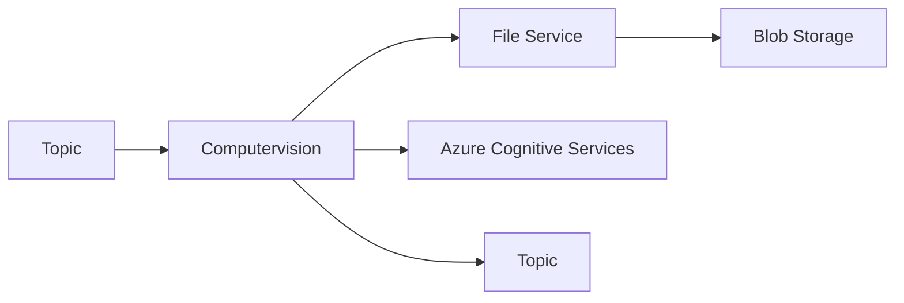

# Computervision

The *Computervision* service is responsible for processing the images and analyses the content.

## Process



## Debugging

The service can be easily debugged locallly.

**Requirements:**

- Dapr installed locally
- File Service running locally
- Azure Cognitive Services

In the _secrets.json_ set the _CognitiveServicesKey_ to the key of your Azure Cognitive Services account.
In the _secretstore.yaml_ replace the path to the _secrets.json_ file.
In the _lauchSettings.json_ set the COGNITIVE_SERVICE_URL_ to the url of your Azure Cognitive Services account.

## Deployment

Navigate to the _Computervision_ folder and run the following command:

```bash
$ spin up --build
```

You will need to start the dapr sidecar separately. Instructions to do so will shortly follow.
